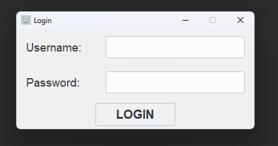
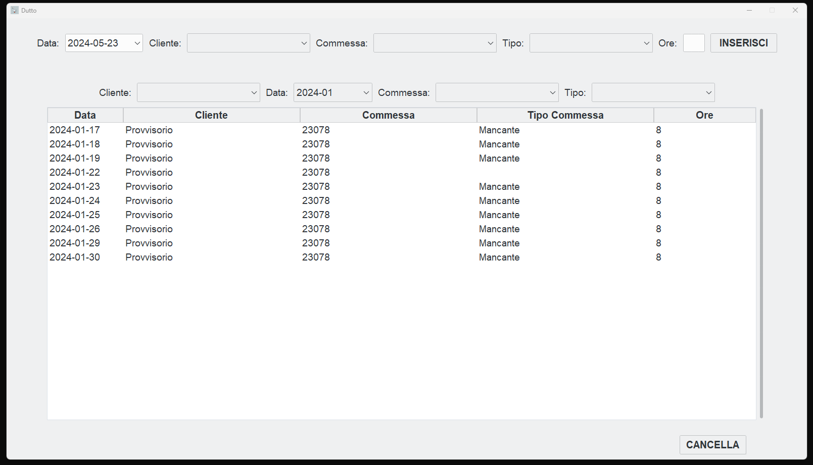
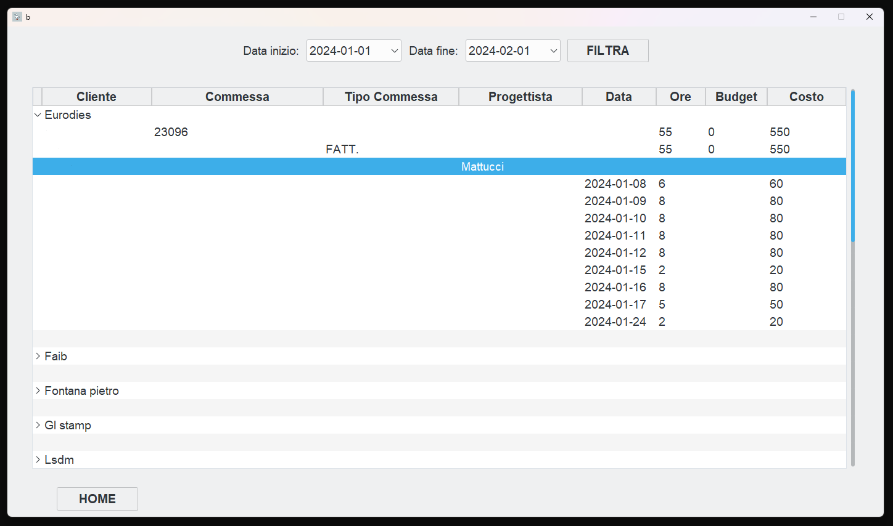

# OCA-EmployeeTimeTracker
OCA-EmployeeTimeTracker is a Python application designed to manage and track employees' working hours in a company. It allows you to log work hours, generate timesheets, and create reports to ensure efficient time management and payroll processing. It was created for free for an italian company composed of 50 employees, to speed up payroll processing and to better manage working hours allocated to projects based on the projects' budget.

## Features
- **Login page**
  


- **Worker page:** where workers can log work hours and consult, sort, filter and delete previously inserted work hours.



- **Manager page**: managers can access to a menu in which they can navigate to three different screens:
  + one where they can define new client and jobs
  + one where they can consult workers work hours grouped by client, job, type of job (usefull to check amount of working hours spend on different projects).
  + one where they can consult workers work hours grouped by workers name, job, type of job (usefull to create paychecks at the end of the month).



- **Admin page**: admins can insert / delete / edit users.

## Installation
To install and run the application, follow these steps:

Clone the repository:
```console
git clone https://github.com/Elbarbons/OCA-EmployeeTimeTracker.git
```

Install the required dependencies:
```console
pip install -r requirements.txt
```

bash
Copia codice
python3 -m venv venv
source venv/bin/activate  # On Windows, use `venv\Scripts\activate`
Install the required dependencies:

bash
Copia codice
pip install -r requirements.txt
Run the application:

bash
Copia codice
python main.py

## Usage
Launch the application using the command python main.py.
Use the interface to:
Add employees and their details.
Log their working hours.
Generate timesheets and reports.

## Contributing
Contributions are welcome! Please follow these steps to contribute:

Fork the repository.
Create a new branch:
bash
Copia codice
git checkout -b feature/your-feature-name
Make your changes and commit them:
bash
Copia codice
git commit -m "Add your message here"
Push to the branch:
bash
Copia codice
git push origin feature/your-feature-name
Open a pull request.

## License
This project is licensed under the MIT License. See the LICENSE file for details.
